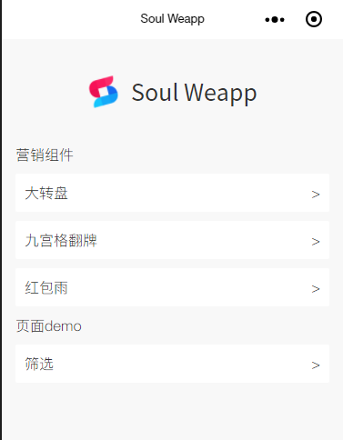
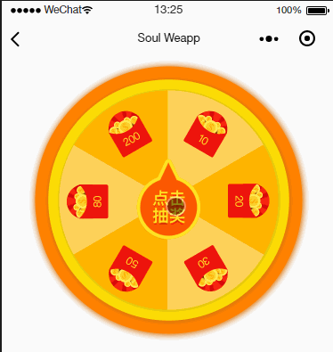
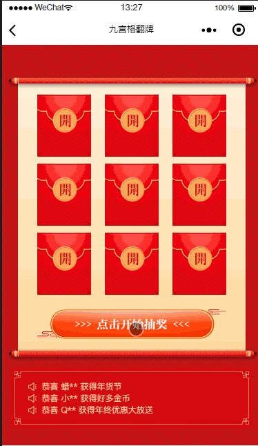
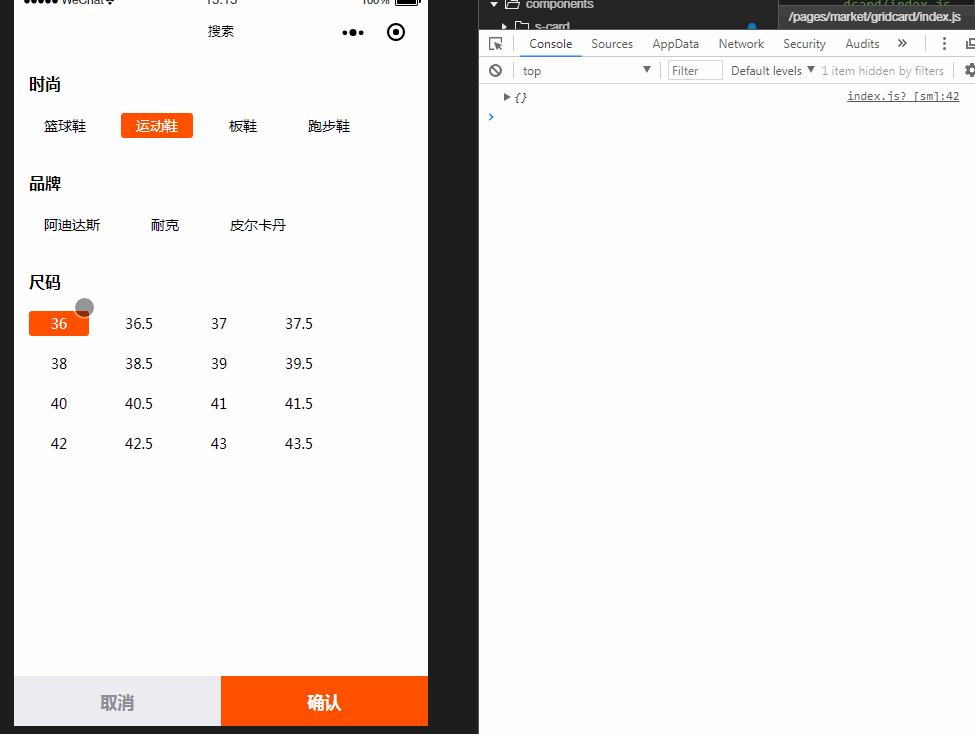

# soul-weapp 简介
小程序常用商城组件案例及营销组件

  

# 运行例子
git clone https://github.com/sunnie1992/soul-weapp.git

微信开发者工具打开项目

#  营销组件

大转盘  "pages/wheel/index"   

  

九宫格翻牌  "pages/gridCard/index"

  

红包雨     "pages/packetRain/index"

  

# 页面
"pages/filter/index"      功能筛选
# 筛选预览

  

# 关于我

您可以扫描添加下方的微信并备注 Soul 加交流群，给我提意见，交流学习。

  

 
如果对你有帮助送我一颗小星星（づ￣3￣）づ╭❤～

