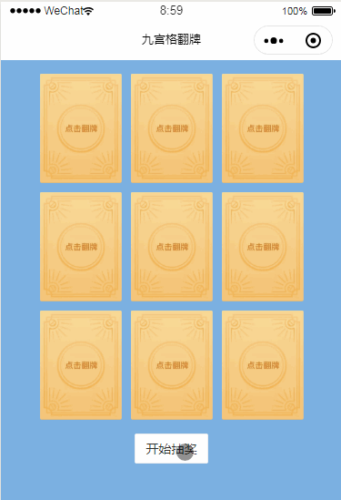

## 红包雨

九宫格翻牌，点击开始抽奖，九宫格纸牌进行进行洗牌动画，点击翻转纸牌。
开发者可根据自身需求修改组件。

## 引入

```json
{
  "usingComponents": {
    "sol-grid-card": "/dist/grid-card/index"
  }
}
```

## 使用

```html
<sol-grid-card id="sol-grid-card" card="{{card}}" bind:open="openCard"></sol-grid-card>
```

## API

| 参数      | 类型     | 描述             | 默认值 |
| --------- | -------- | ---------------- | ------ |
| card      | Array    | 九宫格纸牌数据   | [ ]    |
| bind:open | Function | 点击翻转纸牌触发 | -      |

## 效果展示


