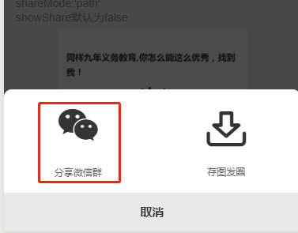

## 图片按钮

图片按钮组件，将微信 button 组件通过图片展示,可触发 open-type 微信开放能力,用于分享页面。配合[微信分享组件](https://sunniejs.github.io/sol-weapp/#/zh-cn/share?id=微信分享组件) 使用
开发者可根据自身需求修改组件。

## 引入

```json
{
  "usingComponents": {
    "image-btn": "/dist/image-btn/index"
  }
}
```

## 使用

```html
<sol-image-btn open-type="share" share-data="{{shareMsgData}}">
  <view slot="img" class="icon-wechat iconfont icon-weixin"></view>
  <view slot="text" class="text">分享微信群</view>
</sol-image-btn>
```

```js
  // 分享
  onShareAppMessage: function(ops) {
      const { share } = ops.target.dataset
      let shareObj = {}
      if (share && ops.from === 'button') {
          shareObj.title = share.shareTitle
          shareObj.path = share.sharePath
          shareObj.imageUrl = share.shareImg
      }
      return shareObj
  }, 
```

## API

| 参数      | 类型   | 描述                                                                                                | 默认值 |
| --------- | ------ | --------------------------------------------------------------------------------------------------- | ------ |
| openType  | String | 具体查看 [button](https://developers.weixin.qq.com/miniprogram/dev/component/button.html) open-type | ''     |
| shareData | Object | 分享参数  | {}     |
| shareData>>shareTitle | String  | 分享给好友卡片标题title ,详情查看[onShareAppMessage](https://developers.weixin.qq.com/miniprogram/dev/reference/api/Page.html#onShareAppMessage-Object-object)                                                                                           | ''     |
| shareData>>sharePath  | String  | 分享给好友卡片路径同path ,详情查看[onShareAppMessage](https://developers.weixin.qq.com/miniprogram/dev/reference/api/Page.html#onShareAppMessage-Object-object)                                                                                | ''     |
| shareData>>shareImg   | String  | 分享给好友卡片图片同imageUrl , 详情查看[onShareAppMessage](https://developers.weixin.qq.com/miniprogram/dev/reference/api/Page.html#onShareAppMessage-Object-object)                                                                                            | ''     |

## slot

| 参数         | 描述                                                                                                |  
| --------- |  --------------------------------------------------------------------------------------------------- |  
| img      | 自定义默认展示图片 |  
| text      | 自定义默认展示文案 |  

 
## 效果展示


