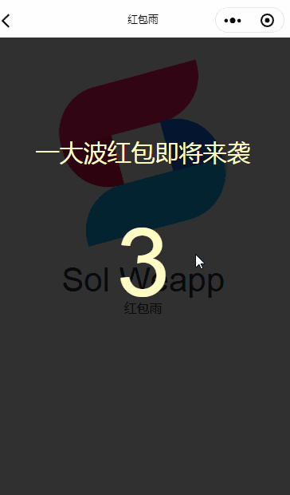

## 红包雨

红包雨,在规定时间内屏幕下落红包，点击获取随机金额。

 新版红包雨删除了动画库依赖[cax](https://github.com/dntzhang/cax),使用Canvas实现无任何依赖开发，更轻，更好引用<br />
 <br />
 新增<br />
  - 倒计时进度条
  - 点击红包打开效果
  - 金币数跟随红包显示
  - 废除了mode模式，因为组件需求多变，用户可根据自身需求具体修改。<br />


注意！！！ 注意！！！<br />
 以下为旧版功能：<br />
 红包发放模式分为两种<br />
 红包总金额有上限，比如：15 秒 100 块金额随机生成 10 个红包下落速度不可控制。<br />
 红包总金额无上限，比如：15 秒红包雨，可设置速度，设置每个红包随机金额的最大值最小值。<br />
旧版红包雨，移步[v1.3.0packet-rain](https://github.com/sunnie1992/sol-weapp/tree/v1.3.0packet-rain)<br />

## 组件

将 example/dist/ 文件下的 packet-rain,style  放入你的组件目录

## 引入

```json
{
  "usingComponents": {
    "sol-packet-rain": "/dist/packet-rain/index"
  }
}
```

## 使用

```html
<sol-packet-rain visible="{{visible}}" createSpeed="{{createSpeed}}" time="{{time}}" readyTime="{{readyTime}}" min="{{min}}" max="{{max}}" bind:finish="success"></sol-packet-rain>

```

## API

| 参数        | 类型     | 描述                                                                        | 默认值 |
| ----------- | -------- | --------------------------------------------------------------------------- | ------ |
| visible     | Boolean  | 是否开始展示游戏                                                            | false  |
| mode  （废除）      | Number   | 红包发放模式<code> 1 </code>:红包总金额有上限<code>2 </code>:红包金额无上限 | 1      |
| createSpeed | Number   | 红包下落速度,数值越小，速度越快。<code>mode 为 2 时生效 </code> 。          | 400    |
| time        | Number   | 游戏时间，单位秒                                                            | 15     |
| readyTime   | Number   | 倒计时准备时间,单位秒                                                       | 5      |
| total  （废除）     | Number   | 红包总金额 <code>mode 为 1 时生效 </code>                                   | 100    |
| number （废除）     | Number   | 红包个数 <code>mode 为 1 时生效 </code>                                     | 1      |
| min         | Number   | 单个红包，最小金额                                                          | 0      |
| max         | Number   | 单个红包，最大金额                                                          | 3      |
| decimal（废除）     | Number   | 金额小数点后位数                                                            | 0      |
| bind:finish | Function | 完成后的回调函数                                                            | -      |


## 效果展示


