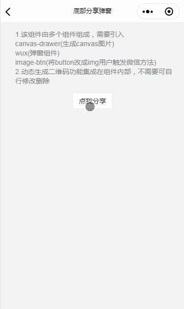

## 微信分享组件

点击分享，弹出分享弹出，方式包括：微信分享给好友生成二维码图片保存到相册。开发者可根据自身需求修改组件。

## 注意

- 该组件由多个组件组成，需要引入 example/dist/  文件下的 painter,wux,image-btn 三个组件组件使用方法如下

  > [Painter](https://github.com/Kujiale-Mobile/Painter)(生成 canvas 图片)

  > [wux](https://github.com/wux-weapp/wux-weapp)(生成 canvas 图片(弹窗组件)
  
  > [image-btn](https://sunnie1992.github.io/sol-weapp/#/zh-cn/image-btn?id=图片按钮)(将 button 改成 img 用户触发微信方法)

- 动态生成二维码功能集成在组件内部，开发者可根据自身需求修改组件。

## 组件

将 example/dist/ 文件下的 painter,wux,image-btn 放入你的组件目录

## 引入

```json
{
  "navigationBarTitleText": "微信分享弹窗",
  "usingComponents": {
    "sol-painter-share-sheet": "/dist/painter-share-sheet/index"
  }
}
```

## 使用

```html
<sol-painter-share-sheet
  id="shareSheet"
  mode="{{shareMode}}"
  visible="{{showShare}}"
  share-data="{{shareData}}"
  bind:path="ImgPath"
/>
```

## API

| 参数                  | 类型    | 描述                                                                                                 | 默认值 |
| --------------------- | ------- | ---------------------------------------------------------------------------------------------------- | ------ |
| visible               | Boolean | 显示底部弹窗                                                                                         | false  |
| mode                  | String  | bar: 分享弹出，可以转发好友，或者生成图片 popup: 无分享弹窗，直接显示图片弹出 path: 直接返回图片路径 | bar    |
| transparent           | Boolean | 弹出窗背景透明                                                                                       | false  |
| shareData             | Object  | 分享数据                                                                                             | {}     |
| shareData>>shareType  | String  | 海报模板类型，用户可生成不同样式的海报图                                                             | ''     |
| shareData>>cardPoster | Boolean | 分享给好友的4：5海报图也需要合成图片                                                                               | false  |
| shareData>>shareParams | Boolean | 生产动态二维码scene参数，需要修改组件代码，详情查看[动态二维码](https://sunnie1992.github.io/sol-weapp/#/zh-cn/share?id=动态二维码)                                                                           | false  |
| shareData>>shareTitle | String  | 分享给好友卡片标题title ,详情查看[onShareAppMessage](https://developers.weixin.qq.com/miniprogram/dev/reference/api/Page.html#onShareAppMessage-Object-object)                                                                                           | ''     |
| shareData>>sharePath  | String  | 分享给好友卡片路径同path ,详情查看[onShareAppMessage](https://developers.weixin.qq.com/miniprogram/dev/reference/api/Page.html#onShareAppMessage-Object-object)                                                                                | ''     |
| shareData>>shareImg   | String  | 分享给好友卡片图片同imageUrl , 详情查看[onShareAppMessage](https://developers.weixin.qq.com/miniprogram/dev/reference/api/Page.html#onShareAppMessage-Object-object)                                                                                            | ''     |
| bind:path             | Function | 配合mode='path'使用,返回海报图路径                                                                 | -      |

## 动态二维码

如果你需要生成动态二维码
将painter-share-sheet组件中的根据提示将代码注释，和打开注释
部分代码如下
```js

// 获取模板json数据，无需生成动态二维码
// ========== 需要生成动态二维码，注释此段以下代码 start ==========
  drawPoster(shareData).then(res => {
      this.setData({
          template: res
      })
  })
// ========== 需要生成动态二维码，注释此段以上代码 end ==========

// ========== 需要生成动态二维码，打开此段以下代码 start ==========
//  // ！！生成二维码路径 pages前面没有"/" 需要截取
//  const sharePath = shareData.sharePath.substr(1).split("?")[0]
//  // 生成动态二维码
//  this.getQrcode(shareData.shareParams, sharePath, 200)
// ========== 需要生成动态二维码，打开此段以上代码 end ==========
 
```
getCodeUrl方法需要服务端配合开发

shareData>>shareParams传生成动态二维码需要的参数scene，根据自己的需求选择[获取小程序码](https://developers.weixin.qq.com/miniprogram/dev/framework/open-ability/qr-code.html)。此次后端使用的[接口 B：适用于需要的码数量极多的业务场景](https://developers.weixin.qq.com/miniprogram/dev/api-backend/open-api/qr-code/wxacode.getUnlimited.html)

## 效果展示


